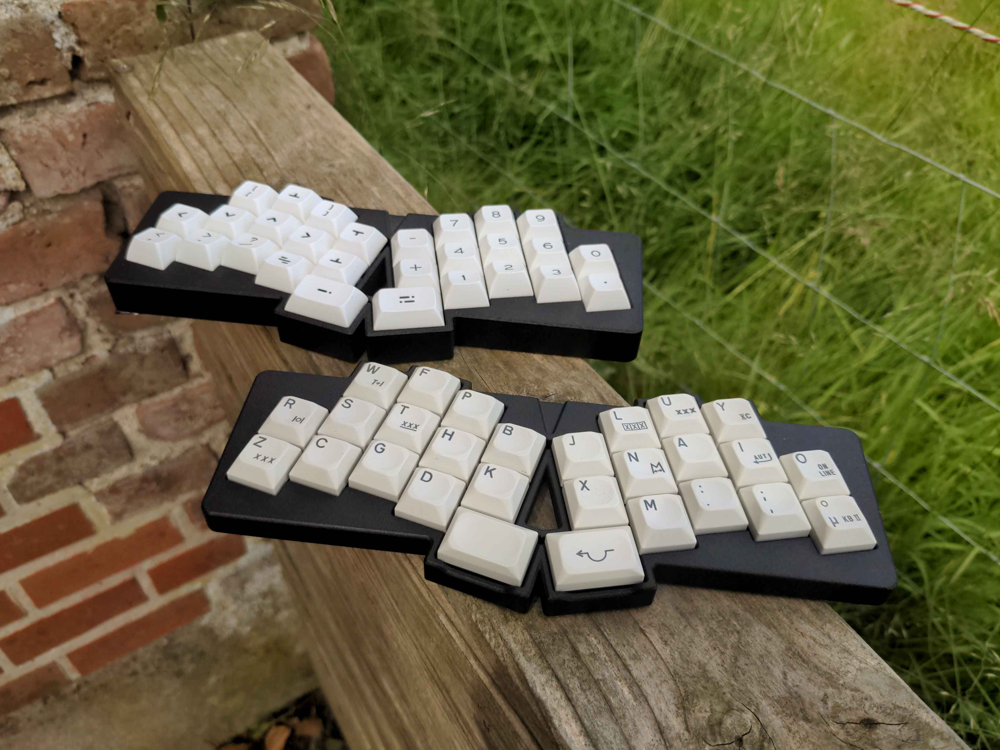

### grumpy

28 key (3-row) angled unibody keyboard with col stagger 

## Features

###### Xiao-Version:

- Hotswap sockets (MX)
- Seeed Xiao Controller
  - RP2040 (w/ QMK, Vial)
  - BLE (w/ZMK)
  - SAMD21 (should work, don't have one to test)
- gerber and case files are supplied (kicad files, stl as well as cadquery files)
- completely open source, permissive license ([CERN-OHL-P](https://cern-ohl.web.cern.ch/home))

###### CH552T-Version:

- Hotswap sockets (MX and Choc V1/V2)
- CH552T Controller (w/ FAK firmware)
- gerber and case files are supplied (kicad files, stl as well as cadquery files)
- completely open source, permissive license ([CERN-OHL-P](https://cern-ohl.web.cern.ch/home))

## Want one?

All production files you need to build your own board can be found [here](./prod/).

The case has no bottom and ends right below the HS Sockets. You may either use it as is, but preferably use some 2-3mm self-adhesive neopren on the whole pcb. The case will be hard to print on a FDM Printer, so maybe use a service to print it in resin or nylon.

Apart from the pcb and optionally a case you need:

###### Xiao-Version

- 28 hotswap sockets
- 28 diodes (1N4148 int SOT-123)
- 28 of your favourite switches
- 1 Controller

###### CH552T-Version:

- 28 hotswap sockets

- 28 diodes (1N4148 int SOT-123)

- 28 of your favourite switches

- 1x CH552T (TSSOP-20)

- 1x USBLC6-2SC6 (SOT-23-6)

- 1x 10kOhm resistor (SMD 0603)

- 2x 5.1kOhm resistors (SMD 0603)

- 2x 100nF capacitors (SMD 0603)

- 1x USB Connector C-Type, 12 pin/16pin, mid-mount (1.6mm)

### firmware

###### Xiao-Version:

firmware configs for qmk and vial can be found in the [firmware folder](./firmware).

The first time the pcb is plugged in, the bootloader will provide a drive to upload the firmware file. 

CH552T-Version:

firmware config for FAK can be found in the firmware folder. Please also see [FAK-Firmware site]([GitHub - semickolon/fak: F.A. Keyboard Firmware](https://github.com/semickolon/fak) for more information

Bootloader should be available on first plugins until firmware is written. After that either use the firmware BOOT to go into bootloader, or hold the boot button on the pcb pressed while pluggin in the usb cable.

### the rest

Everything in this repository is free to use however you might see fit. If you want to support me and my projects, please consider linking back to this repository if you build/change/use anything.

If you would like to send me a tip, you could do it [here](https://ko-fi.com/weteor) (Please don't feel like you have to).

### more pictures

  
